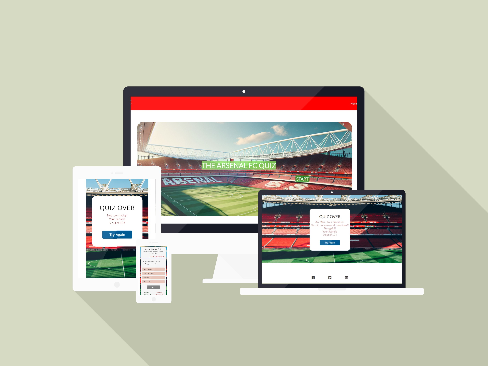
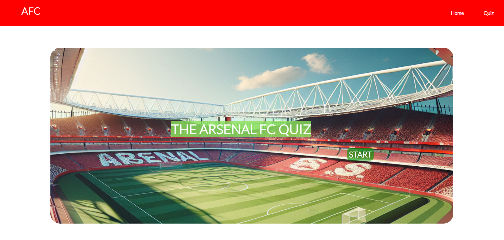
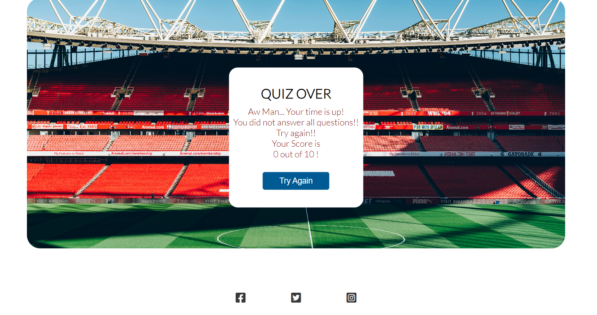

# AFC

Arsenal Football Club, commonly referred to as Arsenal FC or simply Arsenal, is a professional football club based in Holloway, London, England. Established in 1886, Arsenal is one of the most successful clubs in English football history. Here's a brief introduction to the club:

Foundation: Arsenal was founded in 1886 by workers at the Royal Arsenal armaments factory in Woolwich, South London. Originally named Dial Square, the club was renamed Royal Arsenal shortly after.

Success: Arsenal has a rich history of success, particularly during the tenure of legendary manager Arsène Wenger, who managed the club from 1996 to 2018. Under Wenger, Arsenal won three Premier League titles and seven FA Cups, including two league and cup doubles in 1998 and 2002.

Support: Arsenal boasts a large and dedicated fan base, both domestically and internationally. The club's supporters are known for their passionate loyalty and fervent support during matches.

Rivalries: Arsenal has several notable rivalries, including with Tottenham Hotspur (the North London derby), Chelsea, and Manchester United. These matches are fiercely contested and carry significant importance for both sets of supporters.

Overall, Arsenal FC holds a storied legacy in English football, characterized by its success, style of play, and passionate fan base.

The overall aim of this project is to make quiz app which tests the knowledge of football fans on Arsenal FC. This project is inspired by my passion towards this club. 

CHANGE THE LINK BELOW

Visit the deployed website here: https://akshayjay29.github.io/quiz/

## Table of Contents

1. [User Experience (UX)](#user-experience-ux)
    1. [Project Goals](#project-goals)
    2. [User Stories](#user-stories)
    3. [Color Scheme](#color-scheme)
    4. [Typography](#typography)
2. [Features](#features)
    1. [General](#general)
    2. [Home Page](#home-page)
    3. [Quiz Page](#quiz-page)
3. [Languages Used](#languages-used)
4.  [Technologies Used](#technologies-used)
5.    [Testing](#testing)
    1. [Testing User Stories](#testing-user-stories)
    2.  [Code Validation](#code-validation)
    3. [Tools Testing](#tools-testing)
    4. [Manual Testing](#manual-testing)
6. [Deployment](#deployment)
    1. [GitHub Pages](#github-pages)
7. [Credits](#credits)
    1. [Content](#content)
8. [Acknowledgements](#acknowledgements)

***

## User Experience (UX)

### Project Goals

* The website should have a meaningful and bright design, appealing to the users.

* Provide clear instructions that are easy to understand and follow for the user.

* Provide the user with useful social media links that can facilitate future interaction with the brand.

* Offer the customers the opportunity to try again and improve on their initial score.

  
### User Stories

* As a user, I want to be able to navigate through the quiz easily.

* As a user, I want to be able to see whether answer I have selected is correct or incorrect before skipping to the next question.

* As a user, I want to easily find the contact information for the business.

* As a user, I want to find social media links to the brand's social media pages.

* As a user, I want to be able to sswitch between the home page and the quiz page smoothly.

### Color Scheme

* The colors used in the site are red, white and blue (#3498db). This matches the color scheme of Arsenal Football Club, especially the club badge. This is done to create familiarity with the user as they will be familiar with Arsenal's colors. The color scheme also helps illustrates the main subject of the quiz, and explicitly unveils Arsenal Football Club to the user. 

### Typography

The main font used in the site is Lato, with Sans Serif as the fallback font in case Lato is not being imported correctly.
[Back to top ⇧](#afc)

## Features

### General

* Responsive design across all device sizes.

* Similar color scheme and design throughout all pages to effectively structure, categorise and present the information to the customers.

 **Header**
      
- The header contains the business name and fully responsive navigation bar positioned across the top of the screen.

- The navigation bar is identical in all pages and contains links to all pages to facilitate navigation across the site. It also has a hover effect that changes color for a better user experience.

 **Footer**

- The footer includes links to the business' social media channels. 

[Back to top ⇧](#afc)

### Home Page
  

**Navigation Bar**
- Hovering on the different navigation bar's links will trigger a hover effect, highlighting the link for the customer.

- Clicking on the navigation bar's links will bring the user to the specified page.

**Hero Image**
- Hero image is the Emirates stadium, which has a zoom animation is included with a focus to attract the attention of the user This was chosen to be the hero image of the home page as it makes the topic of the quiz very clear to the user. And enances user experience as it creates nostalgia, due to the stadium being the home of Arsenal FC. 

- A text box with the text: "THE ARSENAL FC QUIZ". This has animation per character to atrract the attention of the user.
  
- Below the text, the "START" button is given to direct the user to the quiz page.
        
**Footer**
  - Clicking on the social media links will open the specific website on a new tab.

### Quiz Page
  

**Navigation Bar**
- Hovering on the different navigation bar's links will trigger hover effect, highlighting the link for the customer.

- Clicking on the navigation bar's links will bring the user to the specified page.
        
**Hero Image**
- A closer and inside view of the Emirates stadium, to illustrate to the user that by clicking start, they are now into the quiz and in this experience. Similar to how the hero image, of the quiz page, makes them feel like they are in the stadium. 
      
- Selecting the button "Quiz rules" provides clear instructions to answer the quiz.

-   "Start quiz" button- makes the user experience more easy to understand, as they can clearly identofy what to do next to start the quiz.

**Footer**
  - Clicking on the social media links will open the specific website on a new tab.

**Feedback**
- Each user recieves personalised feeback based on how well they have performed in the quiz.
  
- There is also a try again button at the bottom of this, to enhance the user experience, as they are given another chance to retake the quiz and improve their score.
 
- After clicking the start quiz button, the user is provided with a page that contains question banks.The page has questions with 4 options to select answer. On top of page, there is a timer is provided to alert the user of the remaining time to complete the quiz. The page also has a next button, which will be active once answer option is selected. Once the user click the next button, the next question will appear until it's question 10. At the bottom of the page there is an option to provides the number of correct and incorrect answers given by the user.

- After completing 10 questions, a score box will appear that will exhibit the messages to the users which depends on how many answers are correct.

- the score box has a try again button which will redirect the user to question bank 1. At this stage the timer is restarted back to 180 seconds.

### Languages Used
* [HTML5](https://en.wikipedia.org/wiki/HTML5)
* [CSS3](https://en.wikipedia.org/wiki/CSS)
* [JavaScript](https://en.wikipedia.org/wiki/JavaScript)

### Technologies Used

* [Font Awesome](https://fontawesome.com/)
     - Font Awesome was used throughout all pages to add icons in order to create a better visual experience for UX purposes.

* [GitPod](https://gitpod.io/)
     - GitPod was used for writing code, committing, and then pushing to GitHub.

* [GitHub](https://github.com/)
     - GitHub was used to store the project after pushing.

* [Responsive Design Checker](https://www.responsivedesignchecker.com/)
    - Responsive Design Checker was used in the testing process to check responsiveness on various devices.

* [W3C Markup Validator](https://validator.w3.org/)
    - W3C Markup Validator was used to validate the HTML code.

* [W3C CSS Validator](https://jigsaw.w3.org/css-validator/)
    - W3C CSS Validator was used to validate the CSS code.

* [Mockup Bro](https://mockupbro.com/)
    - Mockup Bro was used to generate mockup images of teh quiz display on different devices. 

[Back to top ⇧](#afc)

## Testing

### Testing User Stories

* As a user, I want to be able to navigate the website intuitively.

     - The website offers an intuitive structure for the customers to navigate and find their wa into starting the quiz. 

    - The navigation bar is clearly presented in all pages for the customers to find with ease and it is easily navigable.

* As a user, I want to easily work through the quiz.

    - The website's home page and quiz follows a consistent color scheme of red, white and dark blue. These three colors compliment each other and are easy to the eye.
 
    - Befoe starting the quiz, each new participant is presented a set of quiz rules on how to rightfully complete the quiz
   
    - There is a quiz timer, which counts down from 180 seconds, to clearly let the user know how much time they have left to complete the quiz.

* As a user, I want to find social media links to the company's social media accounts.

    - The footer provides link to the company's social media channels (note: the website links take you straight to the home pages of the social media apps and not the afc company- as afc is fictional).

### Code Validation

### Tools Testing

* [Chrome DevTools](https://developer.chrome.com/docs/devtools/)

    - Chrome DevTools was used during the development process to test, explore and modify HTML elements and CSS styles used in the project.

The HTML checker notified me an error in my quiz.html page such as the sections lacking heading. And so, I started using h2 and h3 elements. 

The identified errors in both pages were corrected by inspecting in ChromeDevTools.
[W3C CSS Validation](https://jigsaw.w3.org/css-validator/) was used to validate my CSS stylesheet. It found that there was missing brackets, and so I added a couple brackets, to fix all the erros. 

[Jshint validation](https://jshint.com/) was used to validate JavaScript code used in the project. It identified several errors such as missing semicolons in several lines which was corrected by adding semicolon in the JS code. 

### Manual Testing

* Browser Compatibility

    - The website has been tested on the following browsers:

        - **Google Chrome**
        
        No appearance, responsiveness nor functionality issues.

        - **Safari**
        
        No appearance, responsiveness nor functionality issues.

        - **Microsoft Edge**
        
        No appearance, responsiveness nor functionality issues.

* Device compatibility

    - The website has been tested on multiple devices, including:

        - **MacBook Pro 15"**

        No appearance, responsiveness nor functionality issues.

        - **Dell Latitude 5300**

        No appearance, responsiveness nor functionality issues.

        - **iPad Pro 12.9"**

        No appearance, responsiveness nor functionality issues.

        - **iPad Pro 10.5"**

        No appearance, responsiveness nor functionality issues.

        - **iPhone XR**
        
        No appearance, responsiveness nor functionality issues.

        - **iPhone 7**

        No appearance, responsiveness nor functionality issues.
      
[Back to top ⇧](#afc)

## Deployment

* This website was developed using [GitPod](https://www.gitpod.io/), which was then committed and pushed to GitHub using the GitPod terminal.

### GitHub Pages

* Here are the steps to deploy this website to GitHub Pages from its GitHub repository:

    1. Log in to GitHub and locate the [GitHub Repository](https://github.com/).

    2. At the top of the Repository, locate the Settings button on the menu.

    3. Scroll down the Settings page until you locate the Pages section.

    4. Under Source, click the dropdown called None and select Master Branch.

    5. The page will refresh automatically and generate a link to your website.

[Back to top ⇧](#afc)

## Credits

### Content

- All content was written by the developer.
- Format of the quiz was inspired by the Quiz on Coagulation in Water Treatment by dhakal79. Where I took inspiration from their dynamic javascript transitions of the hero images, for my home page and quiz page, as well as the layout of the multiple choice answer options. I then edited this and re-coded it in my own way, to suit my topic. 

[Back to top ⇧](#afc)

## Acknowledgements

* My family, for their constructive opinions and critics during the design and development process. 

* My tutor, Marcel, for his constant feedback and guidance.

* Code Institute and its amazing Slack community for their support and providing me with advice for completing this project.

* Student Care team, for being supportive, and providing consistent feedback.

[Back to top ⇧](#afc)
